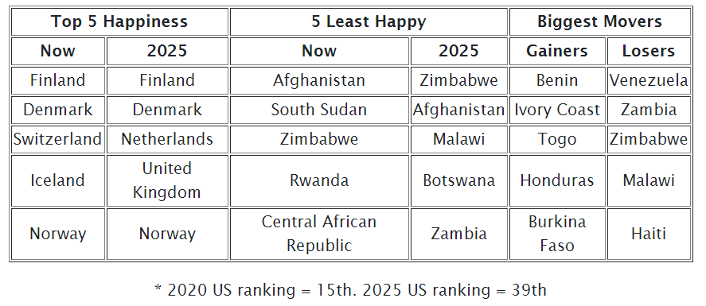
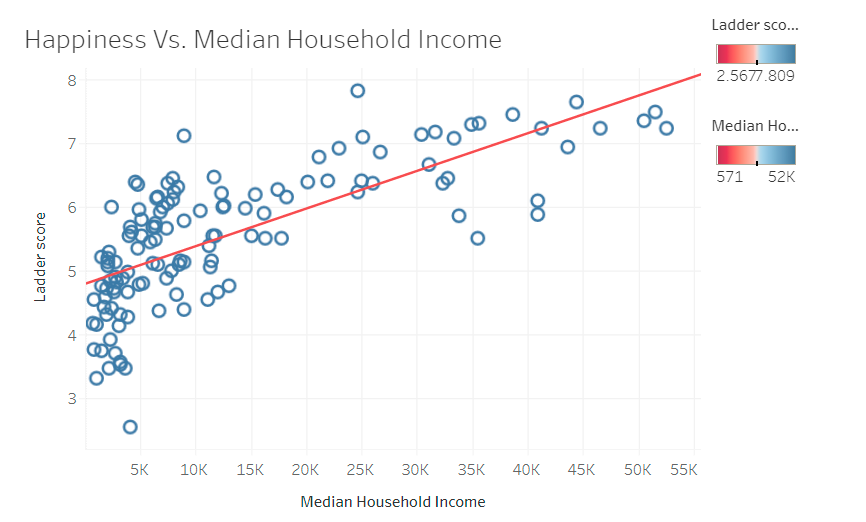
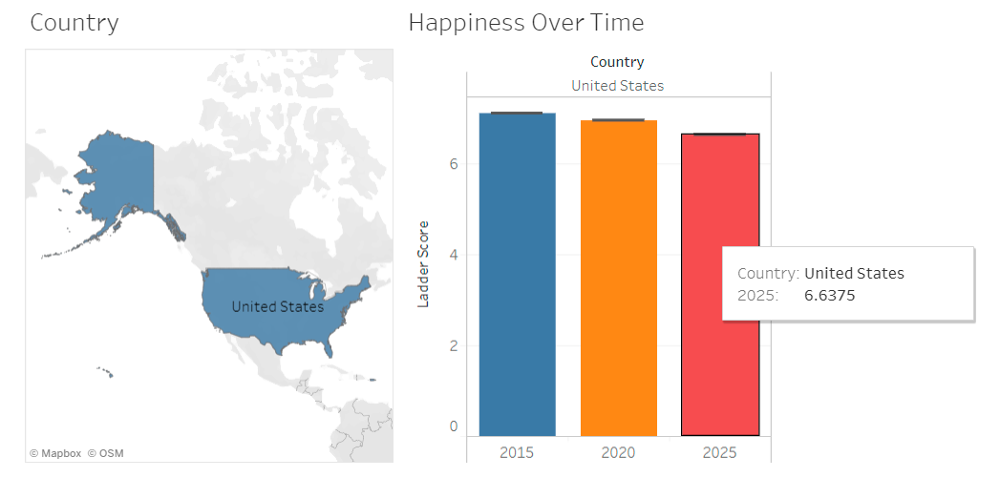

In this project, I worked with 5 other people to answer the question of: Which countries would be the happiest in the future? To answer this, we created a website to display our results. The original data we started with was The World Happiness Reports, and then we did a linear regression which went as far forward as the data went backwards. Therefore, we projected the which countries would be the happiest, least happy, and moved the most spots both positively and negatively. Those results are displayed in the table below. We also included the US rankings for those interested. 

While we were going through the happiness data, we were curious about other factors about the countries that might correlate to happiness. For example, we looked at each country's GDP, phone ownership, military expenditure, literary rate, among other factors. What we found was median household income has probably the strongest correlation. That visualization is shown below. 

We also used a Tableau visualization to show how a country's happiness changed over time, from 2015 to the projected happiness in 2025. I chose the United States and you can see the visualization below. Note, the unit for happiness is based on the Cantril ladder which is a value from 0 to 10. 

          
Lastly, we used a machine learning algorithm, train-test-split, to take in the factors we compiled and predict the happiness of a chosen country. We fed into the model all the metrics previously discussed, and our model predicted the accuracy to .74. Therefore, if given those same metrics, we can predict the happiness of an unknown country with an accuracy of 74%.  
